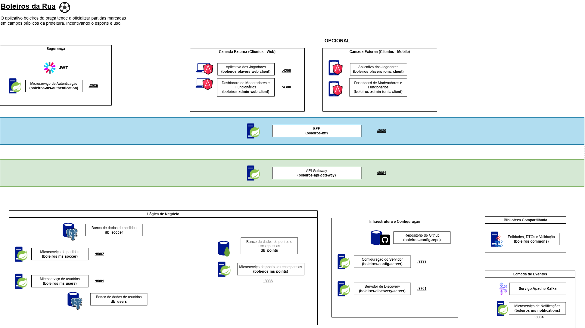
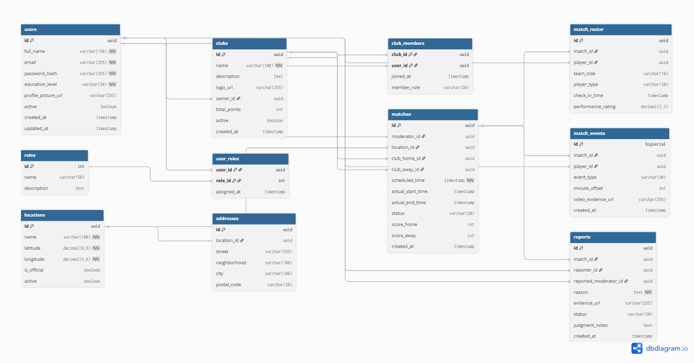
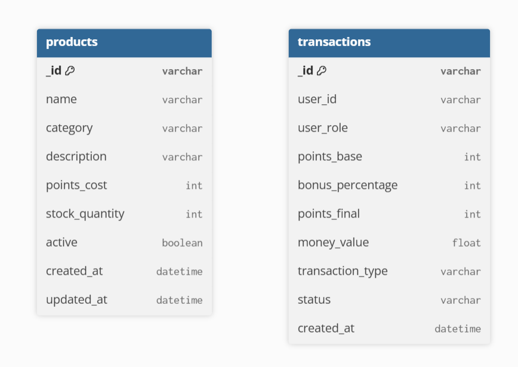

# ⚽ Boleiros da Rua - Documentação Técnica do Sistema

**Versão:** 1.1 (Stack Corrigida: Postgres + MongoDB)  
**Arquitetura:** Microserviços (Spring Cloud), Arquitetura Hexagonal & Event-Driven (Kafka)

---

## 📑 Sumário

1. [Visão Geral e Propósito](#1-visão-geral-e-propósito)
2. [Regras de Negócio Principais](#2-regras-de-negócio-principais)
3. [Arquitetura da Solução](#3-arquitetura-da-solução)
4. [Catálogo de Microserviços](#4-catálogo-de-microserviços)
    - [4.1 Infraestrutura](#41-infraestrutura-e-configuração)
    - [4.2 Borda e Segurança](#42-camada-de-borda-e-segurança)
    - [4.3 Domínio (Lógica de Negócio)](#43-serviços-de-negócio-arquitetura-hexagonal)
    - [4.4 Eventos e Suporte](#44-eventos-e-suporte)
5. [Fluxos de Dados e Eventos](#5-fluxos-de-dados-e-eventos)
6. [Stack Tecnológica](#6-stack-tecnológica)
7. [Roteiro de Implementação](#7-roteiro-de-implementação)
8. [Modelo de Dados](#8-modelo-de-dados)
   - [8.1 Domínio de Identidade e Acesso (`db_users`)](#81-domínio-de-identidade-e-acesso-db_users)
   - [8.2 Gestão de Clubes e Comunidade (`db_soccer`)](#82-gestão-de-clubes-e-comunidade-db_soccer)
   - [8.3 Gestão Espacial e Localidades (`db_soccer`)](#83-gestão-espacial-e-localidades-db_soccer)
   - [8.4 Core de Negócio: Partidas e Súmula (`db_soccer`)](#84-core-de-negócio-partidas-e-súmula-db_soccer)
   - [8.5 Sistema de Integridade e Denúncias (`db_soccer`)](#85-sistema-de-integridade-e-denúncias-db_soccer)
   - [8.6 Domínio de Recompensas e Inventário (`db_points` – MongoDB)](#86-domínio-de-recompensas-e-inventário-db_points--mongodb)
     - [8.6.1 Coleção Products](#861-coleção-products)
     - [8.6.2 Coleção Transactions](#862-coleção-transactions)
---

## 1. Visão Geral e Propósito

O **Boleiros da Rua** é uma plataforma digital distribuída voltada à gestão, incentivo e oficialização de partidas de futebol amador em campos e praças públicas. O sistema visa promover o esporte de forma justa e organizada.

### As Personas
* **Jogadores:** Utilizam o app para agendar partidas, visualizar histórico e participar do sistema de gamificação (pontos e prêmios).
* **Moderadores:** Utilizam um dashboard profissional para arbitrar jogos em tempo real (faltas, gols). Recebem remuneração baseada em pontos convertidos em dinheiro.

---

## 2. Regras de Negócio Principais

1.  **Gamificação:** Jogadores acumulam pontos por partida. O time vencedor recebe um **bônus de 20%** sobre a pontuação base da partida.
2.  **Requisitos do Moderador:** Para se tornar um moderador e monetizar seus pontos, o usuário deve comprovar ter, no mínimo, o **Ensino Médio Completo**.
3.  **Integridade:** Jogadores podem denunciar moderadores com provas. Se confirmado favorecimento ou conduta pejorativa, o moderador é banido.
4.  **Resgate:** Pontos de jogadores viram prêmios (garrafas, camisas). Pontos de moderadores viram dinheiro (Reais).

---

## 3. Arquitetura da Solução

O sistema adota uma **Arquitetura de Microserviços** suportada pelo ecossistema **Spring Cloud**.

* **Padrão Arquitetural de Código:** Os serviços de negócio (`ms-soccer`, `ms-users`, `ms-points`) utilizam **Arquitetura Hexagonal (Ports & Adapters)** para isolar o domínio da infraestrutura.
* **Comunicação Assíncrona:** Utiliza **Apache Kafka** para desacoplar processos críticos (ex: finalização de partida e cálculo de pontos).
* **Persistência Híbrida:** Utiliza **PostgreSQL** para dados relacionais (usuários, partidas) e **MongoDB** para o sistema de pontos e gamificação.

---

## 4. Catálogo de Microserviços

### 4.1 Infraestrutura e Configuração

| Serviço | Porta | Tecnologia | Descrição |
| :--- | :--- | :--- | :--- |
| **boleiros-config-server** | `8888` | Spring Cloud Config | Centraliza arquivos `.yml` de todos os serviços, lendo de um repositório Git privado. |
| **boleiros-discovery-server** | `8761` | Netflix Eureka | *Service Registry*. Permite que os serviços se encontrem dinamicamente sem IP fixo. |

### 4.2 Camada de Borda e Segurança

| Serviço | Porta | Tecnologia | Descrição |
| :--- | :--- | :--- | :--- |
| **boleiros-api-gateway** | `8080` | Spring Cloud Gateway | Backend for Frontend. Único ponto de entrada exposto. Realiza roteamento e *Rate Limiting*. |
| **boleiros-bff** | `8081` | Spring Boot | BaAdaptação de dados (Aggregator) para os apps Cliente Web e Mobile
| **boleiros-ms-authentication** | `8085` | Spring Security / OAuth2 | Provedor de Identidade. Valida credenciais e emite tokens **JWT** com as *roles* (JOGADOR, MODERADOR). |

### 4.3 Serviços de Negócio (Arquitetura Hexagonal)

| Serviço | Porta | Banco de Dados | Responsabilidade |
| :--- | :--- | :--- | :--- |
| **boleiros-ms-users** | `8081` | **PostgreSQL** (`db_users`) | Gestão de perfis (relacional), logins e validação de requisitos de moderadores. |
| **boleiros-ms-soccer** | `8082` | **PostgreSQL** (`db_soccer`) | **Core Domain**. Agendamento, locais, súmulas de jogo e histórico de partidas. |
| **boleiros-ms-points** | `8083` | **MongoDB** (`db_points`) | Gamificação. Banco NoSQL para armazenar histórico de eventos de pontos e catálogo de prêmios flexível. |

### 4.4 Eventos e Suporte

| Componente | Tipo | Tecnologia | Descrição |
| :--- | :--- | :--- | :--- |
| **boleiros-ms-notifications** | Serviço | Spring Boot | Consome eventos do Kafka para enviar E-mails e Push Notifications. |
| **boleiros-commons** | Lib (JAR) | Java | Biblioteca compartilhada contendo DTOs, Exceções globais e Eventos do Kafka. |
| **Event Bus** | Infra | **Apache Kafka** | Broker de mensagens para eventos de domínio (`PartidaFinalizada`, `UsuarioCriado`). |

---

## 5. Fluxos de Dados e Eventos

### 5.1 Fluxo: Finalização de Partida (Cálculo de Bônus)
Este fluxo substitui a necessidade de comunicação síncrona, garantindo que o jogo termine mesmo se o sistema de pontos estiver instável.

1.  **Moderador** finaliza o jogo no Dashboard -> `boleiros-bff` -> `boleiros-ms-soccer`.
2.  `ms-soccer` persiste o placar no PostgreSQL (`db_soccer`).
3.  `ms-soccer` (Adapter Out) publica o evento **`MatchFinishedEvent`** no tópico `soccer.matches.finished` do Kafka.
4.  `ms-points` (Listener) consome o evento.
5.  `ms-points` executa a regra de domínio (bônus de 20%) e salva o extrato no **MongoDB** (`db_points`).
6.  `ms-notifications` (Listener) consome o mesmo evento e envia Push Notification.

### 5.2 Fluxo: Autenticação
1.  App envia login/senha para `boleiros-bff`.
2.  BFF roteia para `boleiros-ms-authentication`.
3.  Auth Service consulta hash de senha no `boleiros-ms-users` (Postgres).
4.  Se válido, gera JWT e retorna ao usuário.

---

## 6. Stack Tecnológica

* **Frontend Web:** Angular 17+ (PWA para jogadores, Dashboard Admin para moderadores).
* **Backend:** Java 17+, Spring Boot 3.
* **Padrões:** Arquitetura Hexagonal, API Gateway, Circuit Breaker (Resilience4j).
* **Dados Relacionais:** **PostgreSQL** (Bases: `db_users`, `db_soccer`).
* **Dados NoSQL:** **MongoDB** (Base: `db_points`).
* **Mensageria:** Apache Kafka.
* **DevOps:** Docker & Docker Compose.

---

## 7. Roteiro de Implementação

A ordem estrita de desenvolvimento para garantir a resolução correta de dependências:

1.  **Infraestrutura Base:**
    * Criar repositório Git (`boleiros-config-repo`).
    * Subir `boleiros-config-server`.
    * Subir `boleiros-discovery-server`.
    * Configurar `docker-compose.yml` (Postgres + MongoDB + Kafka).
2.  **Bibliotecas:**
    * Desenvolver e compilar `boleiros-commons` (DTOs e Eventos).
3.  **Core e Segurança:**
    * Desenvolver `boleiros-ms-users` (JPA + Postgres).
    * Desenvolver `boleiros-ms-authentication` (Depende de users).
4.  **Domínio Principal:**
    * Desenvolver `boleiros-ms-soccer` (JPA + Postgres + Kafka Producer).
5.  **Consumidores:**
    * Desenvolver `boleiros-ms-notifications` (Consumidor).
    * Desenvolver `boleiros-ms-points` (Spring Data Mongo + Kafka Consumer).
6.  **Integração:**
    * Configurar `boleiros-bff` (Rotas e Segurança).

## 8. Modelo de Dados

O design de dados empresarial foi estruturado para garantir a integridade referencial e o isolamento de domínios, permitindo a auditoria completa de cada partida e evento no ecossistema através do PostgreSQL.

### 8.1 Domínio de Identidade e Acesso (`db_users`)
Focado na gestão de perfis, segurança e conformidade de regras de acesso.

* **Tabela `users`**: Atua como a entidade mestre de utilizadores. Contém o campo `education_level` para validar a regra de que moderadores devem possuir, no mínimo, o ensino médio completo.
* **Tabela `roles` e `user_roles`**: Define as permissões de acesso de forma granular, diferenciando perfis de Jogador, Moderador ou Administrador.

### 8.2 Gestão de Clubes e Comunidade (`db_soccer`)
Introduz o conceito de equipas fixas para fidelização dos utilizadores e competitividade organizada.

* **Tabela `clubs`**: Regista as equipas criadas pelos jogadores. Cada clube possui um proprietário e acumula uma pontuação global baseada no desempenho das suas partidas oficiais.
* **Tabela `club_members`**: Gere a adesão dos jogadores aos clubes, permitindo identificar capitães e membros regulares.

### 8.3 Gestão Espacial e Localidades (`db_soccer`)
Centraliza os locais homologados pela prefeitura para a prática desportiva.

* **Tabela `locations`**: Cadastro oficial de campos e praças públicas suportados pela plataforma.
* **Tabela `addresses`**: Estrutura a morada física das localidades para facilitar a busca de praças disponíveis por parte dos jogadores via geolocalização.

### 8.4 Core de Negócio: Partidas e Súmula (`db_soccer`)
Responsável por toda a lógica de agendamento e execução dos jogos em tempo real, suportando equipas fixas ou temporárias.

* **Tabela `matches`**: Registo principal da partida. Se os campos de ID de clube forem nulos, o sistema trata o jogo como uma "equipa temporária" de jogadores avulsos.
* **Tabela `match_roster`**: Lista de jogadores escalados. O campo `player_type` identifica se o atleta é membro do clube, convidado ou um "completa" temporário, permitindo que a partida aconteça mesmo com faltas.
* **Tabela `match_events`**: Regista ocorrências em tempo real (golos, faltas, cartões) com suporte para URLs de evidências em vídeo para auditoria.

### 8.5 Sistema de Integridade e Denúncias (`db_soccer`)
Mecanismo de controlo de conduta e proteção do utilizador contra má moderação.

* **Tabela `reports`**: Canal formal para denúncias efetuadas por jogadores contra a moderação. Exige a submissão de provas para sustentar acusações de favorecimento ou má conduta.

### 8.6 Domínio de Recompensas e Inventário (`db_points` - MongoDB)
O domínio de Recompensas e Inventário é responsável pela gestão de pontos, bónus, conversões financeiras e itens disponíveis para resgate.
Este domínio utiliza MongoDB, pois requer flexibilidade de schema, alto volume de transações e registro histórico imutável.

A base de dados `db_points` é composta por duas coleções principais: products e transactions.

#### 8.6.1. Coleção Products
A coleção `products` representa o **catálogo de itens resgatáveis**, como garrafas, camisolas e outros produtos promocionais.
Cada documento controla o **stock em tempo real**, permitindo atualizações atómicas e evitando inconsistências.

##### **Responsabilidades**
* Armazenar os produtos disponíveis na loja de recompensas
* Controlar a quantidade disponível (`stock_quantity`)
* Permitir ativação/desativação de itens sem perda de histórico
* Garantir consistência de stock via operações atómicas do MongoDB

#### 8.6.2. Coleção Transactions
A coleção `transactions` funciona como um **ledger imutável de pontos**, registrando todas as movimentações do sistema.
Nenhum documento desta coleção é alterado ou removido após a criação, garantindo **auditoria e rastreabilidade**.
##### **Responsabilidades**
* Registrar ganhos de pontos por participação em partidas
* Aplicar automaticamente o bónus de 20% para a equipa vencedora
* Registrar resgates de produtos
* Converter pontos em valor monetário para moderadores
* Manter histórico financeiro e de pontos de forma imutável

O campo transaction_type identifica a natureza da movimentação:
- `EARN` – Ganho padrão de pontos
- `BONUS` – Aplicação de bónus (ex: equipe vencedora)
- `REDEEM` – Troca de pontos por produtos
- `CONVERSION` – Conversão de pontos em dinheiro (moderadores)

O campo status permite controle operacional:
- `CONFIRMED` - Quando finalizado uma compra.
- `PENDING` - Pendente do pagamento de pontos, quando não apertou em 'Confirmar'.
- `CANCELED` - Cancelado por optar 'Cancelar a compra'.